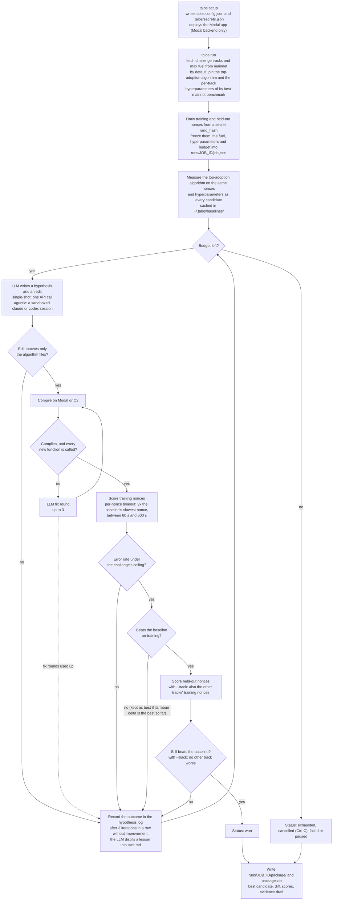

# Talos

Single-user autoresearch for [TIG](https://tig.foundation). You pick a TIG challenge and
describe what to explore. An LLM then repeatedly edits the current top mainnet algorithm for
that challenge, and each candidate is compiled and scored with TIG's own `tig-runtime` and
`tig-verifier` on your own Modal or C3 account. The run stops when a candidate beats the
baseline on both training and held-out nonces, or when the budget runs out. The best
candidate is written to a local, submit-ready package.

Talos never submits to TIG for you, and LLM-authored code never runs on your machine (with
one opt-in exception: [agentic codex](#agentic-mode)).

## Contents

- [How it works](#how-it-works)
- [Try it with no accounts](#try-it-with-no-accounts)
- [Setup](#setup)
- [Running on Windows](#running-on-windows)
- [Running a job](#running-a-job)
- [Command reference](#command-reference)
- [Agentic mode](#agentic-mode)
- [Where results land](#where-results-land)
- [Budget](#budget)
- [Compute backends in detail](#compute-backends-in-detail)
- [Live smoke test](#live-smoke-test)
- [Development](#development)
- [Licence](#licence)

## How it works



Baseline and candidates are always scored on the same nonces, fuel, hyperparameters and
hardware class, so
the delta between them measures the edit and nothing else. The `rand_hash` that seeds the
nonces is never shown to the LLM, so it cannot tune to the exact nonces it is scored on.

The design reasoning is in
[docs/ai/specs/2026-09-11-talos-design.md](docs/ai/specs/2026-09-11-talos-design.md). That
directory is not kept in step with the code; where it disagrees with this README or the
code, it is out of date.

## Try it with no accounts

You can run the whole loop end to end before creating any account. The hidden `--fake` flag
replaces the LLM, mainnet and the compute backend with in-process stand-ins: no config file,
no network, no credentials.

```bash
git clone https://github.com/FibonAdithya/talos.git
cd talos
uv venv --python 3.10 .venv
uv pip install --python .venv/bin/python -e .
.venv/bin/talos run --challenge knapsack --direction "demo" --budget-iterations 3 --yes --fake
```

It finishes in under a second and prints the same event stream a real run does, ending with:

```
Status: won (beat baseline on training and held-out nonces)
Best delta vs baseline: +1.000%
LLM spend: $0.02   Compute spend (estimated): $1.28
Package: .../runs/<job_id>/package
```

The spend figures in a fake run are made up by the stand-ins. Delete `runs/` afterwards if
you do not want the demo job listed by `talos status`.

## Setup

### 1. Prerequisites

- Linux, macOS or Windows. CI runs the test suite on all three. Compiling and scoring happen
  on the compute backend, so nothing Rust- or CUDA-related is needed locally.
- Python 3.10 or newer, and Git.
- [`uv`](https://docs.astral.sh/uv/) to create the virtualenv (recommended; plain `pip`
  works too).
- One compute backend account (step 3).
- One LLM credential (step 4).

### 2. Install

```bash
git clone https://github.com/FibonAdithya/talos.git
cd talos
uv venv --python 3.10 .venv
uv pip install --python .venv/bin/python -e .
source .venv/bin/activate      # puts `talos` on PATH for this shell
talos --help
```

These commands are for bash or zsh. On Windows, follow [Running on Windows](#running-on-windows)
for this step, then come back for steps 3 to 6.

`talos setup` and `talos run` read and write `talos.config.json`, `.talos/secrets.json` and
`runs/` in the **current directory**. Always run Talos from the same directory, normally
the repository root.

### 3. Pick a compute backend

Candidates are compiled and scored on one of two backends. You choose one in `talos setup`.

| Backend | What you need before setup | Cost per iteration |
|---|---|---|
| `modal` (default) | A [Modal](https://modal.com) account (the free tier works) and an API token created at modal.com/settings/tokens. Keep the token id and secret to hand. | Container seconds only; no fixed per-job overhead. |
| `c3` | With a C3 API key (`c3 apikey create`): nothing to install — Talos talks to C3 over HTTPS. Without a key: the `c3` CLI ([cthree.cloud](https://cthree.cloud)) installed and logged in with `c3 login`. Either way, credit on the account; top up with `c3 topup`. | One batch job of about 12 minutes before the first nonce is scored. See [Compute backends in detail](#compute-backends-in-detail). |

### 4. Pick an LLM provider

| Provider | Credential | Environment variable used if `.talos/secrets.json` has no key | Default model |
|---|---|---|---|
| `anthropic` | API key | `ANTHROPIC_API_KEY` | `claude-opus-5` |
| `openai` | API key | `OPENAI_API_KEY` | `gpt-5` |
| `google` | API key | `GEMINI_API_KEY` | `gemini-2.5-pro` |
| `openrouter` | API key | `OPENROUTER_API_KEY` | `anthropic/claude-opus-5` |
| `custom` | API key and base URL of an OpenAI-compatible endpoint | `TALOS_CUSTOM_API_KEY` | none |
| `claude-cli` | A logged-in `claude` CLI on `PATH` | none | `claude-opus-5` |
| `codex-cli` | A logged-in `codex` CLI on `PATH` | none | the first model `codex debug models` lists |

Only the CLI providers (`claude-cli`, `codex-cli`) support [agentic mode](#agentic-mode).
CLI providers bill through your CLI subscription rather than per API call, so the `talos run`
wizard asks them for an iteration budget instead of a dollar budget.

### 5. Run `talos setup`

```bash
talos setup
```

It asks, in order:

1. **Compute backend**: `modal` or `c3`.
2. **Provider**: one of the kinds in the table above.
3. **Model**: press Enter for the default. For `codex-cli` it first prints the models your
   login accepts; for `claude-cli` an alias such as `fable`, `opus` or `sonnet` works.
4. **API base URL**: `custom` provider only.
5. **API key**: API providers only. Each character you type or paste shows as `*`, so you can
   see that a paste arrived; the key itself is never shown.
6. **Mode** (`single-shot` or `agentic`): CLI providers only. This is the default; `talos
   run --mode` overrides it per job.
7. **Modal token id and secret**: `modal` backend only; the secret shows as `*`.
8. **C3 API key**: `c3` backend only; shows as `*`. Leave it blank to use your `c3 login`
   session. With it blank, a `C3_API_KEY` environment variable is used if set.

It then checks everything before writing anything:

- the provider, with one cheap call (for CLI providers: that the binary is on `PATH` and a
  trivial call succeeds);
- on `modal`: sets your Modal token and deploys the benchmark app to your account;
- on `c3`: runs `c3 whoami` and `c3 balance` (with the API key, if you gave one), and warns
  if the balance is below £1.

On success it writes `talos.config.json` and, if you gave an LLM API key or a C3 API key,
`.talos/secrets.json` (mode 0600, holding only those keys; with neither key given, it deletes
any `.talos/secrets.json` left by an earlier setup), and prints
`Setup complete. Run `talos run` to start a job.` If any check fails it prints the reason,
exits non-zero, and does not write `talos.config.json` or `.talos/secrets.json`.

Run `talos setup` again to change provider, model or backend. On the Modal backend, also
run it again after pulling a new version of Talos: the deployed app must match the client,
because the score function's arguments change between versions (it now takes a per-nonce
timeout and per-track hyperparameters). A client that reaches an older deploy stops with a
message naming `talos setup`. The C3 backend ships its code with each job and needs nothing.

### 6. Before your first real run

Run the [live smoke test](#live-smoke-test) for your backend once. It spends a small amount
of real compute and confirms the backend can compile and score the real mainnet algorithm.

## Running on Windows

Talos runs natively in PowerShell or `cmd.exe`; WSL is not needed. (Inside WSL, follow the
Linux instructions instead.) CI runs the full test suite on `windows-latest` for every pull
request. No maintainer has run a real job end to end on a Windows machine yet, so if
something fails there, please open an issue with the command and its output.

### Install

You need Python 3.10 or newer, [Git for Windows](https://git-scm.com/download/win) and
[`uv`](https://docs.astral.sh/uv/getting-started/installation/). Either of these installs
`uv`:

```powershell
powershell -ExecutionPolicy ByPass -c "irm https://astral.sh/uv/install.ps1 | iex"
winget install --id=astral-sh.uv -e
```

Then, in PowerShell:

```powershell
git clone https://github.com/FibonAdithya/talos.git
cd talos
uv venv --python 3.10 .venv
uv pip install --python .venv\Scripts\python.exe -e .
.venv\Scripts\activate         # puts `talos` on PATH for this shell
talos --help
```

If PowerShell refuses to run the activation script ("running scripts is disabled on this
system"), either allow scripts for that one window with
`Set-ExecutionPolicy -Scope Process -ExecutionPolicy RemoteSigned` and activate again, or skip
activation and call `.venv\Scripts\talos.exe` wherever this README says `talos`.

The no-accounts demo from [Try it with no accounts](#try-it-with-no-accounts) is:

```powershell
.venv\Scripts\talos.exe run --challenge knapsack --direction "demo" --budget-iterations 3 --yes --fake
```

Continue with [Setup, step 3](#3-pick-a-compute-backend). `talos setup` and `talos run` ask
the same questions on every OS.

### Translating the other commands in this README

The examples elsewhere are written for bash:

| In this README | PowerShell | `cmd.exe` |
|---|---|---|
| `.venv/bin/python`, `.venv/bin/pytest` | `.venv\Scripts\python.exe`, `.venv\Scripts\pytest.exe` | the same |
| `source .venv/bin/activate` | `.venv\Scripts\activate` | `.venv\Scripts\activate.bat` |
| a trailing `\` to continue a line | a trailing backtick `` ` ``, or put the command on one line | a trailing `^` |
| `VAR=value command` | `$env:VAR = "value"` on its own line, then `command` | `set VAR=value` on its own line, then `command` |
| `~/.talos/baselines/` | `$env:USERPROFILE\.talos\baselines\` | `%USERPROFILE%\.talos\baselines\` |

For example, the live smoke test for the Modal backend is:

```powershell
uv pip install --python .venv\Scripts\python.exe pytest
$env:TALOS_LIVE_CHALLENGE = "knapsack"
.venv\Scripts\python.exe -m pytest -m live tests/test_live.py -s
```

### What differs on Windows

- **Modal backend**: nothing extra. `talos setup` runs the `modal` client that was installed
  into the virtualenv, whether or not the virtualenv is activated.
- **C3 backend**: use a C3 API key. Create one on the
  [C3 dashboard settings page](https://cthree.cloud/dashboard/settings) and paste it at the
  **C3 API key** prompt in `talos setup`. With a key, Talos talks to C3 over HTTPS and nothing
  from C3 needs installing. This path is covered by unit tests, and one real C3 job ran over
  it from Linux on 2026-09-18 (MEASURED, `docs/ai/specs/2026-09-17-c3-mcp-transport-design.md`
  §8). None has run from Windows, so run the [live smoke test](#live-smoke-test) before a real
  run. The `c3` CLI path (key left blank) has not been tried on Windows:
  C3's documented installer is a shell script, and Windows cannot mark job.sh executable on
  disk, so it is unknown whether a job uploaded by the CLI from Windows would start.
- **CLI providers**: `npm` installs `claude` and `codex` as `.cmd` wrappers. Talos finds them
  through `PATH`, so `claude --version` (or `codex --version`) must work in the same window
  you run `talos` from. [Agentic mode](#agentic-mode) uses the same sandbox as on other
  systems; the codex opt-in is `$env:TALOS_ALLOW_CODEX_AGENTIC = "1"`.
- **Secrets**: Windows has no owner-only file permissions, so `.talos\secrets.json` is not
  restricted to your user the way it is on Linux and macOS (mode `0600`). Keep the repository
  in a folder only you can read.
- **Development**: `make` is not installed by default. The [development](#development) install,
  followed by the three commands `make check` runs, is:

  ```powershell
  uv venv --python 3.12 .venv
  uv pip install --python .venv\Scripts\python.exe -r requirements-dev.txt -e .

  .venv\Scripts\python.exe -m ruff check .
  .venv\Scripts\python.exe -m pytest -q -m "not live"
  .venv\Scripts\python.exe -m agentify check .
  ```

## Running a job

### Start

Interactively, answering each prompt:

```bash
talos run
```

Or with every answer given as a flag:

```bash
talos run --challenge knapsack \
  --direction "Try a tighter upper bound in the branch-and-bound pruning" \
  --budget-usd 20 --budget-hours 4 --budget-compute-usd 10 --yes
```

Before the job starts, Talos fetches the challenge's active tracks and fuel from mainnet,
draws the nonces, and prints a line such as
`Job 20260917-101006-knapsack: 5 tracks, fuel ..., budget {...}; hyperparameters: 5/5 tracks from mainnet`. The job id is the start
time plus the challenge name.

### Watch

The terminal prints one line per event (`hypothesis`, `compile_failed`, `scored`,
`confirming`, `won`, ...) and, after each finished iteration, a status line:

```
[status] job=20260917-101006-knapsack it=1 best=+1.000% llm=$0.02 compute≈$1.28 left=3.9h
```

`best` is the best candidate's mean relative delta versus the baseline on training nonces.
`compute≈` is an estimate (see [Budget](#budget)). `left` is the wall-clock budget
remaining, or `∞` without `--budget-hours`.

### Stop

Press `Ctrl-C` once. Talos stops at the next safe point, packages the best candidate found
so far, and prints the final status. The job can be resumed later.

### Resume

```bash
talos status                              # find the job id
talos run --resume 20260917-101006-knapsack
```

A resumed job keeps the provider, model, mode, track, hyperparameters and nonces it started
with, whatever
`talos.config.json` says now. A C3 job that was still running when Talos stopped is
reattached rather than paid for twice.

### Submit

When a job ends with `Status: won`, open `runs/<job_id>/package/README.md`. It explains how
to submit the candidate to TIG. `evidence_draft.md` in the same directory is a partly
filled-in advance-evidence template. You submit it yourself; Talos does not.

A job that ends any other way still writes a package with its best candidate, but that
candidate has not beaten the baseline on held-out nonces, and the package README says so.

## Command reference

| Command | What it does |
|---|---|
| `talos setup` | One-time configuration: backend, LLM provider, credentials. Validates them and deploys the Modal app. |
| `talos run` | Starts or resumes a research job and writes its package when it stops. |
| `talos compile` | Compiles a directory of algorithm files on the configured backend and prints the compiler output. Scores nothing. |
| `talos status` | Lists every job under `runs/` with its status, iteration and spend. |

### `talos setup`

No flags. See [Setup, step 5](#5-run-talos-setup) for every prompt and what is written.
Exit code 0 on success, 1 when a credential or backend check fails, 2 for an unknown
backend or provider.

### `talos run`

Prompts for anything not given as a flag, unless `--yes` is passed.

| Flag | Meaning |
|---|---|
| `--challenge NAME` | `satisfiability`, `vehicle_routing`, `knapsack`, `job_scheduling`, `energy_arbitrage` (CPU), or `vector_search`, `hypergraph`, `neuralnet_optimizer` (GPU, on an L40S). The prompt shows an estimated hourly price for the GPU challenges. |
| `--direction TEXT` | What to explore, in free text. It becomes the first entry in the job's `tacit.md`. |
| `--direction-file PATH` | The same, read from a file. Pass one of `--direction` or `--direction-file`, not both. |
| `--track NAME` | Optimise one active track of the challenge instead of all of them (`all` is the default; the prompt lists the tracks). Training scores that track only. When a candidate wins on training, the confirmation scores that track's held-out nonces plus every other track's training nonces, and no other track may get worse. The LLM still sees and may edit every file. |
| `--hyperparameters mainnet\|none` | `mainnet` (the default) runs the baseline and every candidate with the per-track hyperparameters of the baseline algorithm's best-quality mainnet benchmark at the job's fuel, fixed at job start. A track with no such benchmark runs without any. `none` runs every nonce without hyperparameters. The package lists the values and the benchmark they came from. |
| `--mode single-shot\|agentic` | Overrides the configured mode for this job. `agentic` needs a CLI provider and uses roughly 5 to 20 times the tokens of `single-shot`. |
| `--budget-usd N` | LLM spend cap in USD. |
| `--budget-hours N` | Wall-clock cap in hours. |
| `--budget-iterations N` | Iteration cap. |
| `--budget-compute-usd N` | Estimated compute spend cap in USD. |
| `--resume JOB_ID` | Continue a job that was interrupted, cancelled, paused or failed. Cannot change its mode, track or hyperparameters. |
| `--yes` | Accept defaults instead of prompting. At least one of `--budget-usd`, `--budget-hours` or `--budget-iterations` must still be given; compute defaults to $20. |

Without flags, the wizard asks for challenge, direction, an LLM budget (USD for metered
providers, default 20; iterations for CLI providers, default 50), a wall-clock budget
(default 4 hours), a compute budget (default $20), the mode (CLI providers only), the
track, and the hyperparameters (`mainnet` or `none`).

Talos refuses to start, before spending anything, when: there is no API key for the
provider; the model has no entry in the price table and the only budget is `--budget-usd`
(a dollar cap it could not enforce); the mainnet challenge id no longer matches
`talos/challenges.py`; or, on C3, the challenge's dev image is not mirrored to Docker Hub.

Exit code 0 when the job ends `won`; 1 when it ends any other way, or when the mainnet or
Docker Hub check stops it; 2 for invalid arguments, a missing config, or a missing API key.

### `talos compile`

```bash
talos compile --challenge knapsack --dir algorithm
```

| Flag | Meaning |
|---|---|
| `--challenge NAME` | Required. |
| `--dir PATH` | Directory whose `.rs` and `.cu` files are compiled (default `algorithm`). |
| `--backend modal\|c3` | Backend to use. Without it: `TALOS_BACKEND`, then `talos.config.json`, then `modal`. |

Prints the last 4000 characters of compiler output and exits 0 if the build succeeded, 1 if
it failed, 2 if the directory has no `.rs`/`.cu` files. Agentic mode uses this command to
check its own edits. On Modal it is one function call; on C3 it is one batch job of about 12
minutes, written to `.talos/compile/`, which each run overwrites, so do not run two
`talos compile` commands at once from the same directory.

### `talos status`

```bash
talos status
```

One line per job under `runs/`:

```
20260917-101006-knapsack: won it=1 llm=$0.02 compute=$1.28
```

Status is one of `measuring_baseline`, `researching`, `confirming`, `won`, `exhausted`
(a budget ran out), `cancelled` (Ctrl-C), `paused` (the compute backend was unreachable)
or `failed` (the reason is in `state.json` and the last lines of `timeline.jsonl`).

## Agentic mode

`--mode agentic` (CLI providers only) hands each iteration to a headless `claude` or `codex`
session in a throwaway worktree outside `runs/`, instead of asking an API for one edit.

With `claude-cli`, Talos writes a `.claude/settings.json` that the CLI enforces: reads, `Glob`
and `Grep` are allowed only over `algorithm/**`, `CHALLENGE.md`, `tacit.md`, `AGENTS.md` and
`.talos/hypothesis.json`; the only writes allowed are `Edit` on the algorithm files and on the
hypothesis file; the only command allowed is `talos compile`; `WebFetch`, `WebSearch`, `Write`
and the usual network/shell escapes are denied; and `defaultMode` is `dontAsk`, so any tool not
on the allow list is refused outright rather than prompted for. There is no network access at
the tool level. The child process gets an environment allowlist rather than your environment:
no LLM keys, no Modal tokens.

`codex-cli` is opt-in. Codex ignores `.claude/settings.json`, and its own `--sandbox
workspace-write` restricts writes only — under it the agent can execute arbitrary
agent-authored commands on your machine and read any file you can read. Talos therefore refuses
to start an agentic codex run unless you set `TALOS_ALLOW_CODEX_AGENTIC=1`. In both modes an
edit outside the algorithm files fails the iteration.

On the C3 backend, the sandbox has no `talos.config.json` to read, so the configured
backend is passed to it as `TALOS_BACKEND`, and a C3 API key, if you use one, as
`C3_API_KEY`; each `talos compile` the agent runs from the
sandbox is one C3 job of about 12 minutes. If the agent's 30-minute timeout kills a sandbox
compile while its C3 job is still running, the job is not cancelled: it runs on to its own
time limit and bills for it, which bounds the cost but does not avoid it.

## Where results land

Each job gets a directory under `runs/`:

| Path | Contents |
|---|---|
| `runs/<job_id>/job.json` | The job's fixed inputs: challenge, direction, provider, model, mode, budget, nonces, fuel, track, baseline algorithm, hyperparameters. Written once. |
| `runs/<job_id>/state.json` | Progress: status, iteration, spend, the best candidate, the hypothesis log. |
| `runs/<job_id>/timeline.jsonl` | One JSON event per line; the same events the terminal prints. |
| `runs/<job_id>/tacit.md` | Your direction, plus lessons the LLM distilled from failed attempts. |
| `runs/<job_id>/baseline/` | The baseline algorithm's files and its per-nonce results. |
| `runs/<job_id>/iterations/<n>/` | Each candidate's files and its hypothesis. |
| `runs/<job_id>/best/` | The best candidate's files so far. |
| `runs/<job_id>/package/` | The hand-back package, written when the job stops. |
| `runs/<job_id>/package.zip` | The same package, zipped. |

The package directory holds: the best algorithm's files, `diff_vs_baseline.patch`, `scores.md`
(per-nonce tables for baseline and candidate on training and held-out nonces; a focused job
adds a regression-guard table for the other tracks), `hypotheses.md` (the full log with
outcomes), `evidence_draft.md` (a partially filled-in TIG advance-evidence template), and
`README.md` explaining how to submit, including a Hyperparameters section when the job used
them, whose values are also in `hyperparameters.json`. Benchmark the submitted algorithm with
the same hyperparameters: the measured improvement holds only with them.

On the C3 backend, each job also gets `runs/<job_id>/c3/<n>/` (and
`runs/<job_id>/c3/baseline/` for the baseline measurement): the files C3 generates and
uploads for that job — a .c3 config, a job.sh entrypoint, a payload.json, and copies of
the modules the container needs — plus the pulled artifacts, which land under
`runs/<job_id>/c3/<n>/<c3-job-id>/artifacts/`, where `<c3-job-id>` is C3's own job id from
`c3 deploy`, distinct from the Talos `<job_id>`. The payload carries the job's rand hash
and is uploaded to C3's workspace store as part of the job directory.

The measured baseline is cached separately from the run directory, keyed by challenge,
monorepo ref, algorithm, nonce sets, fuel, hardware class, and hyperparameters: real runs share
`~/.talos/baselines/<challenge>/<key>.json` across jobs, while `--fake` runs (which use no
real network or Modal) keep theirs under `runs/<job_id>/baseline_cache/<challenge>/<key>.json`
instead.

## Budget

At least one of `--budget-usd`, `--budget-hours`, or `--budget-iterations` must be set
(directly, or through the wizard); zero is a valid, real cap, not "unset". Compute spend is
always capped separately in dollars — `--budget-compute-usd`, defaulting to $20 when `--yes`
is passed without it — and is checked before every compute call regardless of the other
dimensions. The wall-clock budget (`--budget-hours`) counts elapsed time from the job's
start, including time spent resumed. Compute spend shown in status lines and the final
report is an **estimate**, computed from measured container seconds times list prices in
a table shipped with Talos — not a billed amount.

LLM spend is likewise measured tokens times a price table. A model with no entry in that
table is shown as `unpriced`, and `--budget-usd` cannot be enforced for it: add
`--budget-hours` or `--budget-iterations`.

Compute spent by `talos compile` from the agentic sandbox is not counted against
`--budget-compute-usd`; on C3 each of those is one job (about 12 minutes of overhead,
MEASURED 2026-09-14) billed at the profile's rate. A focused job's confirmation scores the
other tracks' training nonces too, about a minute more per winning iteration on C3
(ESTIMATE, unverified).

## Compute backends in detail

On the C3 backend Talos uses C3's hosted MCP endpoint (`https://api.cthree.cloud/mcp`) when a C3
API key is configured, and the `c3` CLI when it is not. The key path needs no C3 install, which is
what makes the C3 backend usable on Windows, and it uploads job.sh already marked executable.
Both paths submit the same job directory, which is still written to `runs/<job_id>/c3/<n>/`.

### C3 timings

On C3, one iteration is one batch job with about 12 minutes of fixed overhead before any
nonce is scored — MEASURED 2026-09-14 on a spike run (knapsack, 4 vCPU): about 4 minutes
to script start, 466 seconds to build the candidate, then 1 to 2 seconds per nonce at
mainnet fuel. The release smoke test on 2026-09-15 (MEASURED, knapsack, 4 vCPU, two
training and two held-out nonces) took 12 min 20 s from submission to result: about 2 minutes
queued, 470 seconds to build, 1.3 to 1.7 seconds per nonce; the client's cost estimate was
$0.027 and the account balance fell by £0.02. Modal has no equivalent per-job overhead.

### C3 dev images (maintainers)

C3 pulls only public Docker Hub images, never GHCR. Maintainers mirror the TIG dev images
to `docker.io/fibonadithya/tig-<challenge>-dev:<tag>` with `make mirror-images`
(`scripts/mirror_images.sh`); this only needs running once per `DEV_IMAGE_TAG`, but a tag
bump means re-running it before release. Tags currently mirrored: knapsack 0.0.7 (verified
2026-09-15). Users never touch GHCR or the mirror script themselves. `talos run` on C3
checks the Hub tag before the baseline is measured and fails with a mirror hint if it is
missing. Maintainers can point at a test mirror instead of the real one with
`TALOS_IMAGE_NAMESPACE`.

The mirror script needs `talos` importable, which the system `python3` does not have: from
a fresh shell run `make mirror-images PYTHON=.venv/bin/python`, or activate the venv first
and run plain `make mirror-images` (`Makefile`'s `PYTHON ?= python3` otherwise picks the
system interpreter and fails with "No module named talos").

### Guards between build and scoring

A candidate that compiles but adds a function nothing calls (rustc's `never used` warning
inside the candidate's own files) is not scored: the change is off the solve path and would
score the same as the baseline. It gets the same fix rounds as a compile error, then fails
as `failed:dead_code`.

Each candidate nonce runs under a per-track timeout of three times the baseline's slowest
nonce on that track, never below 60 s and never above the flat 600 s the baseline itself ran
under. A nonce over it is a `timeout` error, and enough of them fail the candidate through
the error ceiling. TIG caps fuel, not seconds, so this is a limit on research cost, not a
TIG rule: `Thresholds.runtime_ceiling` in `talos/loop.py` sets the multiplier, and 0
disables it.

## Live smoke test

`tests/test_live.py` (marker `live`, excluded from `make check`) compiles and scores the
real mainnet top algorithm for one challenge on your deployed Modal app:

```bash
TALOS_LIVE_CHALLENGE=knapsack .venv/bin/pytest -m live tests/test_live.py -s
```

For the C3 backend, a separate test runs one real C3 job end to end; it needs `c3 login` (or
`C3_API_KEY` set) and a few pence of credit (MEASURED 2026-09-15: £0.02 billed, 12 min 20 s
wall clock, job `SUCCEEDED`, `1 passed`):

```bash
TALOS_LIVE_BACKEND=c3 .venv/bin/pytest -m live tests/test_live.py -k c3 -s
```

Both need `pytest`: install it with `uv pip install --python .venv/bin/python pytest`, or use
the development install below.

Run these once yourself after `talos setup`, before trusting a real run. The C3 test was
run by the maintainers on 2026-09-15 (see above); the Modal test has not been run by the
developers of this repository (no Modal or LLM credentials were available in the
development environment).

## Development

The gate needs Python 3.11 or newer, because the pinned `agentify` in `requirements-dev.txt`
does. CI uses 3.12.

```bash
uv venv --python 3.12 .venv
uv pip install --python .venv/bin/python -r requirements-dev.txt -e .
make check PYTHON=.venv/bin/python
```

`make check` runs ruff, pytest without the `live` marker, and the agentify contract check.
It is the same command CI runs. See `AGENTS.md` for the invariants a change must keep.

## Licence

GPLv3 (see `LICENSE`). `talos/search_replace.py` is lifted from
[tig-foundation/prometheus-swarm](https://github.com/tig-foundation/prometheus-swarm)
(its file scripts/search_replace.py), also GPLv3; `talos/agentic.py`'s sandbox settings mirror
Prometheus's `_build_sandbox_settings` design without copying its code.
