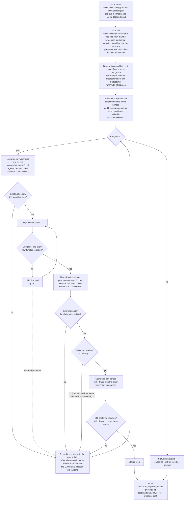

# How Talos works

What a job does from `talos run` to the hand-back package, and the rules that keep a
candidate's score comparable with the baseline's. For setup and the commands, see
[README.md](../README.md). For the two compute backends, see
[compute-backends.md](compute-backends.md).

The design reasoning is in
[docs/ai/specs/2026-09-11-talos-design.md](ai/specs/2026-09-11-talos-design.md). That
directory is not kept in step with the code; where it disagrees with this document, the
README or the code, it is out of date.

## The research loop

Baseline and candidates are always scored on the same nonces, fuel, hyperparameters and
hardware class, so the delta between them measures the edit and nothing else. The
`rand_hash` that seeds the nonces is never shown to the LLM, so it cannot tune to the exact
nonces it is scored on.

## Guards between build and scoring

A candidate that compiles but adds a function nothing calls (rustc's `never used` warning
inside the candidate's own files) is not scored: the change is off the solve path and would
score the same as the baseline. It gets the same fix rounds as a compile error, then fails
as `failed:dead_code`.

Each candidate nonce runs under a per-track timeout of three times the baseline's slowest
nonce on that track, never below 60 s and never above the flat 600 s the baseline itself ran
under. A nonce over it is a `timeout` error, and enough of them fail the candidate through
the error ceiling. TIG caps fuel, not seconds, so this is a limit on research cost, not a
TIG rule: `Thresholds.runtime_ceiling` in `talos/loop.py` sets the multiplier, and 0
disables it.

## The agentic sandbox

`--mode agentic` hands each iteration to a headless `claude` or `codex` session in a
throwaway worktree outside `runs/`. See [Agentic mode](../README.md#agentic-mode) for when to
use it.

With `claude-cli`, Talos writes a `.claude/settings.json` that the CLI enforces:

- Reads, `Glob` and `Grep` are allowed only over `algorithm/**`, `CHALLENGE.md`, `tacit.md`,
  `AGENTS.md` and `.talos/hypothesis.json`.
- The only writes allowed are `Edit` on the algorithm files and on the hypothesis file.
- The only command allowed is `talos compile`.
- `WebFetch`, `WebSearch`, `Write` and the usual network and shell escapes are denied, so
  there is no network access at the tool level.
- `defaultMode` is `dontAsk`, so any tool not on the allow list is refused outright rather
  than prompted for.

The child process gets an environment allowlist rather than your environment: no LLM keys,
no Modal tokens.

`codex-cli` is opt-in. Codex ignores `.claude/settings.json`, and its own `--sandbox
workspace-write` restricts writes only: under it the agent can execute arbitrary
agent-authored commands on your machine and read any file you can read. Talos therefore
refuses to start an agentic codex run unless you set `TALOS_ALLOW_CODEX_AGENTIC=1`.

With either CLI, an edit outside the algorithm files fails the iteration.

## The baseline cache

The measured baseline is cached outside the run directory, keyed by challenge, monorepo ref,
algorithm, nonce sets, fuel, hardware class and hyperparameters. Real runs share
`~/.talos/baselines/<challenge>/<key>.json` across jobs. `--fake` runs keep theirs under
`runs/<job_id>/baseline_cache/<challenge>/<key>.json`.
