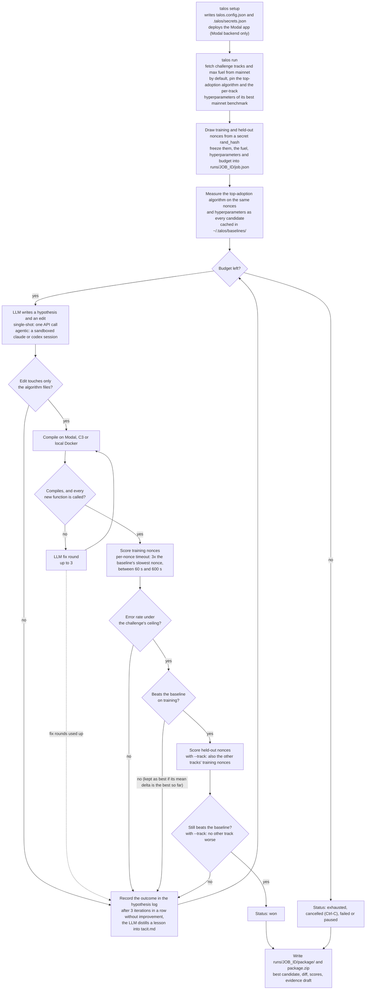

# How Talos works

What a job does from `talos run` to the hand-back package, and the rules that keep a
candidate's score comparable with the baseline's. For setup and the commands, see
[README.md](../README.md). For the three compute backends, see
[compute-backends.md](compute-backends.md).

The design reasoning is in
[docs/ai/specs/2026-09-11-talos-design.md](ai/specs/2026-09-11-talos-design.md). That
directory is not kept in step with the code; where it disagrees with this document, the
README or the code, it is out of date.

## The research loop

```mermaid
flowchart TD
    setup["talos setup<br/>writes talos.config.json and .talos/secrets.json<br/>deploys the Modal app (Modal backend only)"]
    start["talos run<br/>fetch challenge tracks and max fuel from mainnet<br/>by default, pin the top-adoption algorithm and the per-track<br/>hyperparameters of its best mainnet benchmark"]
    spec["Draw training and held-out nonces from a secret rand_hash<br/>freeze them, the fuel, hyperparameters and budget into runs/JOB_ID/job.json"]
    baseline["Measure the top-adoption algorithm on the same nonces<br/>and hyperparameters as every candidate<br/>cached in ~/.talos/baselines/"]
    budget{"Budget left?"}
    propose["LLM writes a hypothesis and an edit<br/>single-shot: one API call<br/>agentic: a sandboxed claude or codex session"]
    scope{"Edit touches only<br/>the algorithm files?"}
    compile["Compile on Modal, C3 or local Docker"]
    builds{"Compiles, and every<br/>new function is called?"}
    fix["LLM fix round<br/>up to 3"]
    score["Score training nonces<br/>per-nonce timeout: 3x the baseline's slowest nonce,<br/>between 60 s and 600 s"]
    errors{"Error rate under<br/>the challenge's ceiling?"}
    beats{"Beats the baseline<br/>on training?"}
    confirm["Score held-out nonces<br/>with --track: also the other tracks' training nonces"]
    confirmed{"Still beats the baseline?<br/>with --track: no other track worse"}
    failed["Record the outcome in the hypothesis log<br/>after 3 iterations in a row without improvement,<br/>the LLM distills a lesson into tacit.md"]
    won["Status: won"]
    stop["Status: exhausted, cancelled (Ctrl-C), failed or paused"]
    package["Write runs/JOB_ID/package/ and package.zip<br/>best candidate, diff, scores, evidence draft"]

    setup --> start --> spec --> baseline --> budget
    budget -- yes --> propose --> scope
    budget -- no --> stop
    scope -- no --> failed
    scope -- yes --> compile --> builds
    builds -- no --> fix --> compile
    fix -. "fix rounds used up" .-> failed
    builds -- yes --> score --> errors
    errors -- no --> failed
    errors -- yes --> beats
    beats -- "no (kept as best if its mean delta is the best so far)" --> failed
    beats -- yes --> confirm --> confirmed
    confirmed -- no --> failed
    confirmed -- yes --> won
    failed --> budget
    won --> package
    stop --> package
```

Baseline and candidates are always scored on the same nonces, fuel, hyperparameters and
hardware class, so the delta between them measures the edit and nothing else. The
`rand_hash` that seeds the nonces is never shown to the LLM, so it cannot tune to the exact
nonces it is scored on.

## Native research scoring

`talos run --scoring native` changes how research candidates are scored, not how a winner is
decided. The default is `--scoring metered`: every nonce of every candidate runs under
`tig-runtime` with TIG's fuel counter, as the baseline did. It is slow because the build
instruments every dependency's IR and the runtime meters every instruction. In native mode a
candidate is built into the `talos-native` runner (`talos/native_runner.py::render` writes it,
`talos/inside.py::build_native` builds it), which has no fuel counter and stops when the
solve has run for a time budget (exit 87). The loop then scores research candidates natively
and only an improving one is scored on the metered runtime.

**Calibration.** A native run has no fuel limit, so a per-track time budget stands in for it.
`talos/loop.py::Loop.calibrate` finds one after the baseline, on every start and resume. The
record is keyed by challenge, hardware class, both pins, the baseline's code and its
hyperparameters (`talos/calibration.py::calibration_key`); nonce sets are not in the key, so
one record serves later jobs on the same baseline and is cached in `~/.talos/calibration/`.
With no record, Talos scores the baseline's training nonces natively with no budget and
reads the metered fuel from the baseline's stored rows (or, for a baseline cached before fuel
was recorded, from one metered call). For each track the ratio is the median of native
`solve_us` over metered `fuel_consumed` (`talos/calibration.py::track_ratios`). The budget is
ratio x the job's fuel x a margin, never below one second
(`talos/calibration.py::budgets_us`). The starting margin is 0.8, a validation that finds a
metered out-of-fuel nonce the native run finished counts a miss for its track, and every third
miss lowers that track's margin by 0.1 to a floor of 0.3
(`talos/calibration.py::record_miss`). The 0.8, the 0.1 step, the 0.3 floor, the limit of 3
misses and the one-second floor are ESTIMATES with no measurement behind them; they are
tuned from the misses the records collect. The record stores the ratio measured when it was
created, plus each track's margin and miss count; it never re-measures the ratio, and the
budget is computed from it and the job's fuel each time.

**Validation.** A candidate that would become the best natively is first scored on the
metered runtime, on the job's training nonces, by `talos/loop.py::Loop._validate_and_finish`.
`talos/scoring.py::validation_failure` checks, in this order, and the first failure is the
demotion reason: the candidate builds metered (`native_metered_build_mismatch`); no metered
nonce ran out of fuel where the native run still had budget (`fuel_proxy_miss`,
`talos/scoring.py::fuel_proxy_misses`); every nonce both paths solved within their limits
has the same quality (`nondeterministic`, `talos/scoring.py::quality_mismatches`; a row
carries `limit_hit` when the solver exited 87, and a limit-cut nonce is never a quality
mismatch); the metered result is scoreable (`unscoreable`); its error rate is under the
challenge's ceiling (`error_ceiling`); and the loop's own improvement rule holds, meaning
its mean delta exceeds the current best's or it beats the baseline (`not_improved`). The
last check is not `beats` alone, so a stepping stone that improves on the best without yet
beating the baseline is kept. A pass makes the candidate the best with its metered results,
and held-out confirmation (`talos/loop.py::Loop._confirm`) runs on the metered path only. A
failure leaves the previous best in place, appends a `demoted` entry to `state.json`'s
`validations`, and counts in the calibration record. In native mode the recall record
carries no native-versus-metered runtime ratio; a validated best gets the metered one.

**Why the verifier uses the unmetered PTX.** For a GPU challenge the native build writes its
own PTX beside the metered one, without `inject_fuel_and_runtime_sig`
(`talos/inside.py::build_native_ptx`), and the native run and `tig-verifier` are given that
file. The metered PTX is instrumented for fuel and is loaded by `tig-runtime`, which the
native runner does not use.

**Fallback and resume.** When the baseline fails the native build, no track gets a ratio, or
a needed track has none, the job records `scoring: metered`, emits `calibration_fallback`
with the reason and runs metered for the rest of its life. A resume keeps the job's own
budgets: `Loop.calibrate` does not re-derive them once set, because another job may have
tightened the record since and a changed budget changes the request of a C3 job still
running. A calibration interrupted between its metered and native calls keeps the metered
rows in `pending_job["calibration_metered"]`, so the resume goes straight to the native call.
The scoring mode itself is frozen in `job.json`, and `--resume` refuses a different one.

**What was measured.** All MEASURED, on 2026-09-29, from the design spec's claims table
(`docs/ai/specs/2026-09-29-native-research-scoring-design.md`, section 10):

| Measurement (hypergraph) | Value | Source |
|---|---|---|
| Metered build | 286.6 s | probe job job_1790678981167_ip26xh |
| Native build, cold / warm / PTX | 43.9 / 27.7 / 3.7 s | same job |
| Scoring 5 nonces, metered / native | 609 / 234 s | same job |
| Quality across 4 runs, all tracks | identical | same job, and the baseline `results.json` of run 20260929-073341-hypergraph |
| Submission to script start on C3 | 28 s | same job's C3 log |

Local knapsack, native against metered (MEASURED 2026-09-29, this machine's Docker, mainnet
top `knap_exact16`, track `n_items=1000,budget=10`, `max_fuel` 5,000,000,000,000, 3 training
nonces): the quality is equal on all 3 nonces (233007, 309510, 232131); one evaluate with
the build took 260.8 s metered and 60.6 s native; a nonce's runtime was 881 to 960 ms metered
and 657 to 703 ms native. The CPU runner template compiled on the first attempt, offline.
The GPU template has not been compiled yet; the first compile is the live parity test
(`tests/test_live.py::test_native_parity`), which a person runs.

ESTIMATES, not measured: scoring one hypergraph candidate takes about 4.6 minutes native
against about 15 minutes metered (the sum of the rows above); the knapsack ratio of about
1.7e-4 us per fuel unit would put a budget at `max_fuel` and margin 0.8 near 690 s, above
the 600 s per-nonce timeout, so on that track the timeout would bind first; other CPU
challenges behaving like hypergraph is unmeasured.

## Guards between build and scoring

A candidate that compiles but adds a function nothing calls (rustc's `never used` warning
inside the candidate's own files) is not scored: the change is off the solve path and would
score the same as the baseline. It gets the same fix rounds as a compile error, then fails
as `failed:dead_code`.

Each candidate nonce runs under a per-track timeout of three times the baseline's slowest
nonce on that track, never below 60 s and never above the flat 600 s the baseline itself ran
under. A nonce over it is a `timeout` error, and enough of them fail the candidate through
the error ceiling. TIG caps fuel, not seconds, so this is a limit on research cost, not a
TIG rule: `Thresholds.runtime_ceiling` in `talos/loop.py` sets the multiplier, and 0
disables it.

## The agentic sandbox

`--mode agentic` hands each iteration to a headless `claude` or `codex` session in a
throwaway worktree outside `runs/`. See [Agentic mode](../README.md#agentic-mode) for when to
use it.

With `claude-cli`, Talos writes `.talos/claude-settings.json` in the worktree and passes it
with `--settings`; the CLI enforces it:

- Read rules name `algorithm/**`, `CHALLENGE.md`, `tacit.md`, `AGENTS.md` and
  `.talos/hypothesis.json`. Claude Code also lets the agent read any other file in its working
  directory, so in practice reads are confined to the worktree, settings file included; reads
  outside it are denied. There are no `Glob` or `Grep` rules: CLI 2.1.284 has no such tools,
  and agents search with Bash `grep` and `ls`.
- The only writes allowed are edits (which also cover `Write`) to the algorithm files and to
  the hypothesis file. The settings file itself is outside that scope.
- The only command on the allow list is `talos compile`. Claude Code runs read-only commands
  such as `ls` and `grep` inside the working directory without a rule.
- `WebFetch`, `WebSearch` and the usual network and shell escapes are denied, so there is no
  network access at the tool level.
- `defaultMode` is `dontAsk`, so any tool not on the allow list is refused outright rather
  than prompted for.
- Every file rule is an absolute path to the worktree. Claude Code resolves a relative rule
  against the shell's current directory, so after an agent ran `cd algorithm` a relative
  `Edit(algorithm/**)` matched nothing and its edits were refused.
- The file is not `.claude/settings.json`: Claude Code also reads that path as project
  settings and ignores their allow list in a directory nobody has trusted.

The child process gets an environment allowlist rather than your environment: no LLM keys,
no Modal tokens.

`codex-cli` is opt-in. Codex ignores that settings file, and its own `--sandbox
workspace-write` restricts writes only: under it the agent can execute arbitrary
agent-authored commands on your machine and read any file you can read. Talos therefore
refuses to start an agentic codex run unless you set `TALOS_ALLOW_CODEX_AGENTIC=1`.

With either CLI, an edit outside the algorithm files fails the iteration.

## The baseline cache

The measured baseline is cached outside the run directory, keyed by challenge, monorepo ref,
dev image tag, crate layout, algorithm, nonce sets, fuel, hardware class and hyperparameters. Real runs share
`~/.talos/baselines/<challenge>/<key>.json` across jobs. `--fake` runs keep theirs under
`runs/<job_id>/baseline_cache/<challenge>/<key>.json`.

`job.json` records the dev image tag as well as the monorepo ref. A resume refuses a
different ref, a different image or a legacy job without a recorded image before starting
compute or changing saved state. Start a new job after a pin bump so its baseline and
candidates are measured with the same build. Finished jobs can still be inspected and
their packages regenerated.
